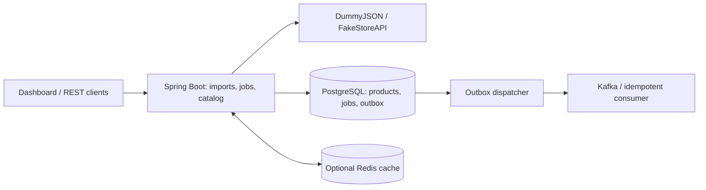
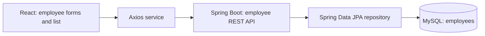
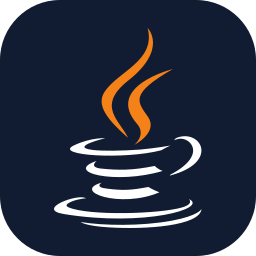
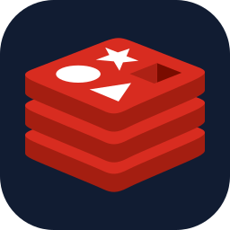
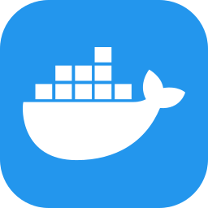
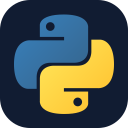

# Build. Retry. Keep going.

I'm **Abhishek Kumar**, a **Systems Architect at Pega Systems India**, based in Bengaluru. I build Java and Spring Boot projects around APIs, background jobs, and **what happens when something fails**.

<strong>Got 30 seconds? Start here.</strong>

- **My focus:** Java / Spring Boot backend roles, building on enterprise application experience.
- **My featured build:** an API ingestion service with persisted jobs, retries, request idempotency, scheduling, and an operations dashboard.
- **Under the hood:** PostgreSQL, a transactional Kafka outbox, Redis, Docker, and automated verification.
- **Want the reasoning?** The [case study](docs/api-ingestion-service.md) covers design decisions, verification, tradeoffs, and current limits.

## Project Showcase

Open a project to explore its features, architecture, verification, and design decisions.

<h2>01 · API ingestion service — Java / Backend</h2>

**Two external APIs. One consistent product catalog.**

A Spring Boot service that imports and normalizes product data, runs background jobs, and exposes import progress through a dashboard.

**Stack:** Java 21 · Spring Boot · PostgreSQL · Kafka · Redis · Docker

 

[Architecture](#api-ingestion-architecture) · [Verification](#api-ingestion-verification) · [Design decisions](#api-ingestion-design-decisions)

### API ingestion architecture

The worker fetches source data and persists products and jobs. Catalog reads can use Redis with database fallback; a separate dispatcher retries delivery of persisted outbox events.

### Feature highlights

- **Repeat requests, one job.** User-scoped idempotency keys recover the original job on a retry and detect conflicting settings.
- **Retry with a plan.** Bounded retries, exponential backoff with jitter, and `Retry-After` handling.
- **Keep events for later.** A transactional Kafka outbox retains events for delivery retries.
- **Cache down? Keep reading.** Catalog reads fall back to PostgreSQL.
- **Restart without starting over.** Products and completed job history survive restarts, verified through Docker container recreation.

### API ingestion verification

Backend and PostgreSQL checks, dashboard tests, and Docker-stack persistence checks. The [case study's verification snapshot](docs/api-ingestion-service.md#verification) records the inspected successful run.

### API ingestion design decisions

A bounded worker queue makes overload explicit. The outbox ties event delivery to persisted data, with idempotent handling of repeated deliveries. Redis is optional, so cache failure retains a database read path.

**Current limits:** personal, single-instance setup. Unfinished jobs are marked failed after a restart; production identity, TLS, and distributed worker coordination are planned improvements.

**[Full case study →](docs/api-ingestion-service.md)** · Source repository currently private.

<h2>02 · Employee Management — Full stack / CRUD</h2>

**A React interface backed by a Spring Boot employee API.**

An earlier full-stack CRUD project for creating, viewing, updating, and deleting employee records.

**Stack:** React · Java 8 · Spring Boot 2.3 · Spring Data JPA · MySQL

 

[Architecture](#employee-management-architecture) · [Verification and boundaries](#employee-management-verification-and-boundaries)

### Employee Management architecture

The frontend service calls the employee API. A REST controller handles CRUD requests and delegates persistence to the JPA repository.

### Feature highlights

- **Manage employee records.** Create, list, view, update, and delete through REST endpoints.
- **Connect interface and backend.** React calls the Spring Boot API through an Axios service.
- **Persist through JPA.** Employee IDs, names, and email addresses map to database records.
- **Handle missing records.** Lookup, update, and delete operations return HTTP 404 when the requested employee is absent.

### Employee Management verification and boundaries

The frontend service, REST controller, model, exception, and Maven configuration were reviewed for this showcase. **The application was not rerun for this profile update.**

This is an earlier CRUD project using Java 8 and Spring Boot 2.3. It demonstrates frontend/API/persistence integration; authentication, validation, pagination, and a modernized stack are not claimed.

**[Project walkthrough →](docs/employee-management.md)** · Source repository currently private.

## My techstack

  
  
  
  
  
  
  
  
  
  
  

<strong>Techstack details</strong>

### Java 21

The primary language for the API ingestion service. The earlier Employee Management project uses Java 8.

### Spring

Spring Boot organizes the backend APIs and background work. Spring Security and Spring Data JPA are part of the ingestion service stack.

### PostgreSQL

Persists products, job history, and outbox events in the API ingestion service. Flyway manages database migrations.

### Kafka

Receives events from the persisted transactional outbox. Consumer processing handles repeated deliveries.

### Redis

An optional catalog cache. Reads fall back to PostgreSQL when the cache is unavailable.

### Docker

Docker Compose runs the local stack. Testcontainers provides isolated database containers for integration checks.

### AWS

Cloud platform for compute, storage, networking, and managed services.

### Python

A general-purpose language in my toolkit, useful for scripting and automation.

### React

Provides the employee forms and list interface in the earlier full-stack Employee Management project.

### Maven

Builds the Java projects and manages dependencies. The backend verification build includes JUnit checks.

### GitHub Actions

Runs the ingestion service's verification workflow and this profile's link, asset, and review-date checks.

<strong>Next on my build list</strong>

Production identity and TLS, distributed worker coordination, request budgets, record retention, and dead-letter replay. These are planned improvements to the project.

## Send a hello

Interested in Java / Spring Boot backend work, APIs, or reliable data pipelines?

