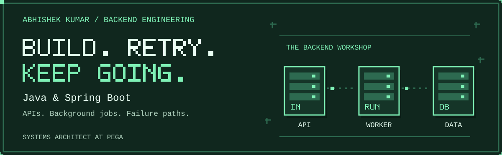
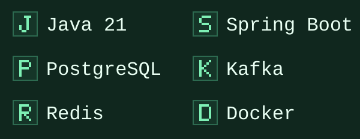

# Build. Retry. Keep going.

I'm **Abhishek Kumar**, a **Systems Architect at Pega Systems India**, based in Bengaluru. I build Java and Spring Boot projects around APIs, background jobs, and **what happens when something fails**.

  

<strong>Got 30 seconds? Start here.</strong>

- **My focus:** Java / Spring Boot backend roles, building on enterprise application experience.
- **My featured build:** an API ingestion service with persisted jobs, retries, request idempotency, scheduling, and an operations dashboard.
- **Under the hood:** PostgreSQL, a transactional Kafka outbox, Redis, Docker, and automated verification.
- **Want the reasoning?** The [case study](docs/api-ingestion-service.md) covers design decisions, verification, tradeoffs, and current limits.

## Current build · API ingestion service

**Two external APIs. One consistent product catalog. Visibility into every import.**

A Spring Boot service that imports and normalizes product data for paginated reads. Its dashboard shows job progress, retry waits, event delivery, and cache behavior.

### Feature highlights

- **Repeat requests, one job.** User-scoped idempotency keys recover the original job on a retry; changed settings with the same key return a conflict.
- **Retry with a plan.** Bounded retries, exponential backoff with jitter, and `Retry-After` handling when upstream APIs fail or rate-limit requests.
- **Keep events for later.** A transactional Kafka outbox persists events for delivery retries, with idempotent handling of repeated deliveries.
- **Cache down? Keep reading.** Catalog reads fall back to PostgreSQL when Redis is unavailable.
- **Restart without starting over.** PostgreSQL retains products and job history, verified through Docker container recreation.

**[Go inside the build →](docs/api-ingestion-service.md)** · **[Architecture →](docs/api-ingestion-service.md#architecture)**

The source repository is private; the public case study is available without repository access or a running demo.

## My toolkit

**Also in the toolbox:** Python · Spring Security · Spring Data JPA · Flyway · JUnit · Testcontainers · Docker Compose · GitHub Actions

<strong>Next on my build list</strong>

Production identity and TLS, distributed worker coordination, request budgets, record retention, and dead-letter replay. These are planned improvements to the project.

## Send a hello

Interested in Java / Spring Boot backend work, APIs, or reliable data pipelines?  
**[abhiiyyywork7@gmail.com](mailto:abhiiyyywork7@gmail.com)**
