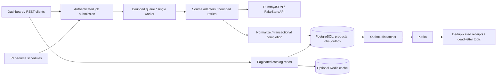

# API ingestion service

**Personal backend project · Java 21 / Spring Boot · Source currently private**

[← Profile overview](../README.md) · [Architecture](#architecture) · [Failure behavior](#failure-behavior) · [Verification](#verification) · [Boundaries](#boundaries)

## The problem

Importing data from an external API becomes more interesting when requests time out, clients retry, source IDs overlap, or the application restarts. This project imports product catalogs from DummyJSON and FakeStoreAPI and gives operators a view of the entire import lifecycle.

It fetches and normalizes source records, persists products, tracks background jobs, and exposes paginated REST reads. A browser dashboard shows progress and saved history, supports per-source schedules, and reports event-delivery and cache activity.

## Architecture

**Reading the diagram:** users or schedules submit jobs; a bounded worker fetches each source and completes the database transaction. A separate outbox dispatcher delivers events to Kafka. Catalog reads can use Redis and fall back to PostgreSQL.

## Design decisions

| Decision | Why it matters | Tradeoff |
| --- | --- | --- |
| One worker with a bounded queue | Serializes imports in one application instance and makes overload explicit. | It limits throughput and does not coordinate distributed workers. |
| Fetch every page before writing products | Avoids saving a partial catalog when a later page fails. | The import needs bounded page and record budgets. |
| Identity is `(source, source_id)` | Two upstream catalogs can share numeric IDs without colliding. | Consumers must keep source identity. |
| Request idempotency is separate from record deduplication | Resending a submission finds the same job; a new import can update existing products. | Keys stay reserved while their job records remain. |
| Persist events through an outbox | A broker failure can be retried without losing the recorded terminal event. | Delivery is at least once; consumers must handle duplicates. |
| Cache with a database-backed catalog revision | Imports invalidate stale catalog reads; database fallback keeps reads available. | Redis is expendable, and cache availability is not a correctness guarantee. |

## Failure behavior

- **Transient source failures:** bounded exponential backoff with jitter. Rate-limit responses can introduce shared per-source `Retry-After` pauses, subject to wait budgets.
- **Queue saturation:** reject new work with HTTP 503 rather than allowing an unbounded backlog.
- **Lost submission response:** resubmit the same idempotency key and settings to recover the original job. Reusing the key with different settings returns HTTP 409.
- **Broker unavailable:** retain events in the transactional outbox for subsequent delivery attempts.
- **Duplicate event delivery:** persist receipts by event ID; failed consumer processing can route to a dead-letter topic.
- **Redis unavailable:** serve catalog reads from the database.
- **Application restart:** persistent products and completed jobs survive. Unfinished jobs are marked failed; a new submission retries the import rather than silently resuming it.

## Verification

The repository contains backend tests, PostgreSQL integration contracts, browser interaction checks, and a full Docker-stack smoke check. The latest inspected GitHub Actions run completed successfully for commit `04ef558` on **8 October 2026**.

| Check | What it covers |
| --- | --- |
| Backend and PostgreSQL container checks | The Maven verification build, real PostgreSQL contracts, and a gate that rejects skipped container checks. |
| Browser interaction checks | Dashboard behavior with simulated API responses and desktop/mobile screenshots. |
| Full-stack smoke check | Real HTTP, PostgreSQL, Kafka, Redis, and deterministic upstream fixtures. |
| Container recreation | Saved products, completed jobs, event receipts, and schedules persist; a later import and event still work. |

This is an inspected verification snapshot, not a live uptime claim. Browser mocks alone do not establish that the full backend stack works; the separate full-stack check covers that path.

## Boundaries

This is a **single-instance local portfolio setup**, with one Kafka broker. It does not claim high availability or production readiness.

Current authentication uses a development account and Basic authentication. Production identity, TLS, workflow RBAC, distributed workers, proactive request budgets, retention, and manual dead-letter replay remain future work.

The source stays private. The public profile does not expose application passwords, local configuration, private source links, or employer systems.

*Last reviewed: 2026-10-09*
