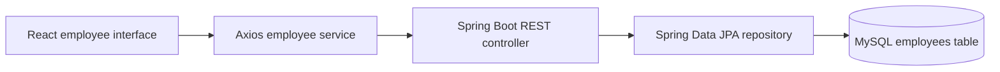

# Employee Management

**Earlier full-stack CRUD project · React / Spring Boot / MySQL · Source currently private**

[← Profile overview](../README.md) · [Architecture](#architecture) · [Verification](#verification) · [Boundaries](#boundaries)

## The project

A React interface connects to a Spring Boot REST API to create, list, view, update, and delete employee records. Each employee record contains an ID, first name, last name, and email address.

This example complements the API ingestion service by showing a straightforward frontend-to-API-to-database integration.

## Architecture

The frontend's employee service sends GET, POST, PUT, and DELETE requests. The backend controller exposes the employee endpoints and uses a JPA repository for database reads and writes. The employee model maps fields to an `employees` table and uses generated IDs.

## Features present in the reviewed source

- List employees and fetch one employee by ID.
- Create an employee record.
- Update the employee's first name, last name, and email address.
- Delete an employee and return a deletion response.
- Return HTTP 404 for missing records during lookup, update, and delete.
- Call the backend from the React application's Axios service.

## Implementation choices

- **Separate frontend and backend:** keeps the interface and REST service independently organized.
- **Direct controller-to-repository calls:** a simple structure for this CRUD example; a dedicated service layer would become useful as business rules grow.
- **Spring Data JPA:** delegates common persistence operations to the repository.
- **Explicit missing-record handling:** absent employee IDs produce an HTTP 404 response.

## Verification

The reviewed source snapshot is commit `a30fe43`. This profile review inspected the frontend employee service, REST controller, JPA model, missing-record exception, and Maven dependencies.

The reviewed Maven configuration targets **Java 8**, **Spring Boot 2.3.0**, Spring Data JPA, and the MySQL JDBC driver.

**The application was not built or run as part of this profile update.** These are source-review findings, not a claim of passing runtime tests or a currently available demo.

## Boundaries

This is an earlier CRUD example. Authentication, request validation, pagination, concurrency controls, and deployment hardening are not presented as implemented features. Its dependency versions would need review and modernization before further deployment work.

The source stays private. This walkthrough describes the design without publishing source code, configuration values, or private repository links.

*Last reviewed: 2026-10-09*
